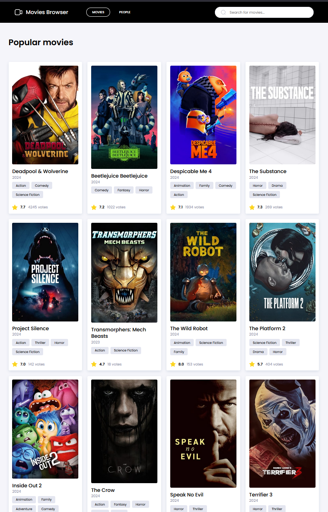

# Movies Browser

## Description

**This is the old version of the app, originally created as a group project by a team of three people. I made modifications and optimizations independently and migrated an improved version to TypeScript. You can find the updated version here: https://github.com/sofyahreksoftware/movies-browser**

Movies Browser is your gateway to the world of films and filmmakers. Explore thousands of movies and details about cast and crew through our easy-to-navigate site. Features include:

- **Movie Browsing:** Discover new popular films by release date, rating, vote count, and more.
- **Detailed Information:** Each movie page offers details on production locations, release dates, cast and crew.
- **People Browsing:** Search and browse pages for actors and creators, featuring birthdates, biographies, and filmographies.
- **Search Engine:** Easily find movies and people.
- **Easy Navigation:** Navigate through lists with our intuitive menu and pagination.

Visit us to experience the best available database of movies and movie-related personnel!

## Visual Overview of Features

## Technologies

### HTML

- HTML5: Leveraging the latest HTML standards for structure and semantics.
- Accessibility: Implementing ARIA roles and semantic HTML to enhance accessibility.
- Open Graph Protocol
- Google Fonts

### JavaScript & Frameworks

_Core Technologies_

- **React** - for building the user interface, emphasizing reusable components
- **ReactDOM** - for rendering of React components in the DOM
- **Webpack** - for compiling and bundling JavaScript modules
- **Babel** - for transforming ES6+ JavaScript into a backwards-compatible version
- **PostCSS** - for transforming CSS with JavaScript plugins

_State Management_

- **Redux Toolkit** - for efficient Redux development with optimized state management
- createSlice
- configureStore
- **React-Redux** - for integrating Redux with React to manage application state.
- Provider
- useSelector
- useDispatch

_Utilities and Hooks_

- **fetch** with **async/await** and **Error Handling** - for asyncronious data fetching
- **nanoid** - for generating unique identifiers
- **useEffect** Hook - for performing side effects in functional components
- **URLSearchParams** - for manipulating URL parameters

_Routing_

- **react-router-dom** - for handling routing
- Hashrouter
- Route
- Link, Navlink
- route params
- useNavigate, useParams, useLocation

## Additional information

This project was bootstrapped with [Create React App](https://github.com/facebook/create-react-app).

## Available Scripts

In the project directory, you can run:

### `npm start`

Runs the app in the development mode.\
Open [http://localhost:3000](http://localhost:3000) to view it in your browser.

The page will reload when you make changes.\
You may also see any lint errors in the console.

### `npm run build`

Builds the app for production to the `build` folder.\
It correctly bundles React in production mode and optimizes the build for the best performance.

The build is minified and the filenames include the hashes.\
Your app is ready to be deployed!

See the section about [deployment](https://facebook.github.io/create-react-app/docs/deployment) for more information.

### `npm run eject`

**Note: this is a one-way operation. Once you `eject`, you can't go back!**

If you aren't satisfied with the build tool and configuration choices, you can `eject` at any time. This command will remove the single build dependency from your project.

Instead, it will copy all the configuration files and the transitive dependencies (webpack, Babel, ESLint, etc) right into your project so you have full control over them. All of the commands except `eject` will still work, but they will point to the copied scripts so you can tweak them. At this point you're on your own.

You don't have to ever use `eject`. The curated feature set is suitable for small and middle deployments, and you shouldn't feel obligated to use this feature. However we understand that this tool wouldn't be useful if you couldn't customize it when you are ready for it.
